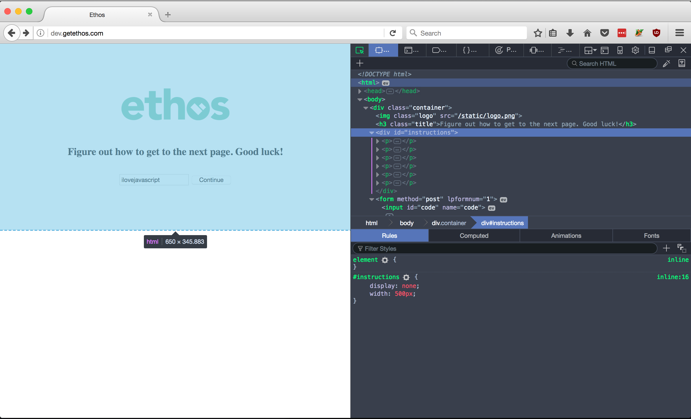
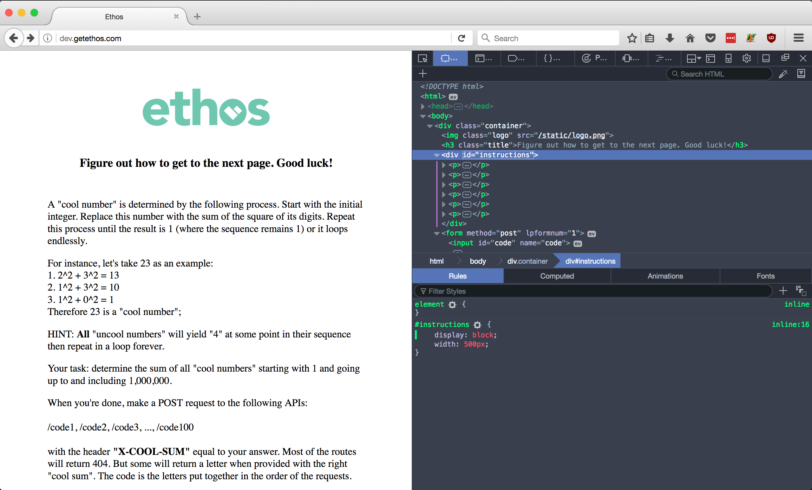
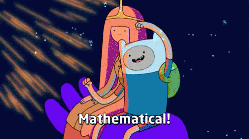

# Solving the getethos puzzle 

### you can try it yourself at [dev.gethethos.com](dev.gethethos.com)

#### Part 1 -- flooping the front

Problem one  is the page itself -- can't see anything, man. Alright let's pop this site into firefox, because Safari is a joke and Chrome doesn't have a dark setting. 

Upon inspecting the page, we can see a div element which contains a bunch of paragraph elements, but they're not on the page. Clicking on the div titled "instructions" allows us to see its styles, and apparently its display is set as 'none'. 

Let's flip that display to 'block' and read our instructions. 

---

#### Part 2

Alright so the problem seems pretty straight forward. Determine if every number between 1 and 1,000,000 (inclusive) is a 'cool' number, and if so, add it to our final sum. 

There are a few approaches we can take. My code uses the absolute dumbest and most direct way -- perform the calculation for every number. 

A friend thought about storing the result of every calculation and logging how it ends. The final product was supposed to be a sort of lookup table which would tell us how a sequence of calculations would end. 

To visualize this a little better: 

5 → 25 
25 → 29 
29 → 85 
85 → 89 
89 → 145 
145 → 42 
42 → 20 
20 → 4 

Any time we encounter any of the numbers in the left column, we can safely cut the calculation and skip to returning a 'false' or whatever it takes to indicate that we don't have a cool number. 

I feel like this approach would be awesome for very large ranges, but might suffer in the short run.

After summing up all the cool numbers, we send POST requests to the specified URL(s) and parse each response to get the answer to the puzzle. 

Base64 decode aWxvdmVqYXZhc2NyaXB0Cg== to get the answer. 

